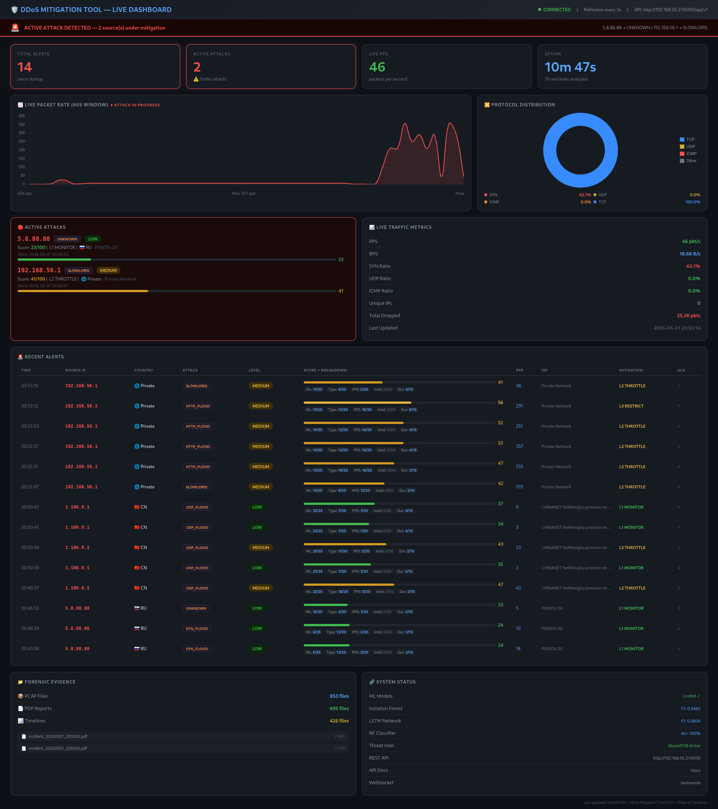

# 🛡️ DDoS Mitigation Tool v2.0

> A comprehensive network security platform combining real-time 
> traffic analysis, machine learning anomaly detection, automated 
> mitigation, and SIEM integration.


---

## 📸 Screenshots

### Live Dashboard During Attack


### Terminal Detection Output


---

## 🏗️ Architecture
Packet Capture (Scapy)
→ Feature Extraction (20+ features per 5s window)
→ Isolation Forest + LSTM Hybrid Detection (F1: 0.98)
→ Random Forest Attack Classifier (6 types, 100% accuracy)
→ Threat Intelligence (AbuseIPDB + GeoIP + Redis cache)
→ Composite Threat Scoring (0-100)
→ Graduated Mitigation (L1 Monitor → L5 NullRoute)
→ PCAP Capture + Forensic PDF Reports
→ FastAPI REST API (14 endpoints + WebSocket)
→ React Live Dashboard

## 🎯 Attack Types Detected

| Attack | Detection Method | Mitigation |
|--------|-----------------|------------|
| SYN Flood | RF(100%) + ISO + LSTM | iptables hashlimit |
| UDP Flood | RF(97%) + ISO + LSTM | iptables hashlimit |
| ICMP Flood | RF(93%) + ISO + LSTM | iptables hashlimit |
| HTTP Flood | RF(94%) + ISO + LSTM | rate limit + CAPTCHA |
| Slowloris | RF(91%) + ISO + LSTM | connection limits |
| Volumetric | Rule-based | null route |

## 🤖 ML Models

| Model | Purpose | Performance |
|-------|---------|-------------|
| Isolation Forest | Anomaly detection | F1: 0.9485 |
| LSTM Neural Network | Temporal pattern analysis | F1: 0.9804 |
| Random Forest | Attack classification | Accuracy: 100% |

## 🔒 Mitigation Ladder

| Level | Score | Action | Method |
|-------|-------|--------|--------|
| L1 MONITOR | 0-39 | Log only | — |
| L2 THROTTLE | 40-54 | Rate limit 50pps | iptables hashlimit |
| L3 RESTRICT | 55-69 | Rate limit 10pps | iptables hashlimit |
| L4 BLOCK | 70-84 | Hard block | iptables DROP |
| L5 NULLROUTE | 85-100 | Permanent ban | ip route blackhole |

## 🚀 Quick Start

### Prerequisites
- Ubuntu 20.04+
- Docker + Docker Compose
- VirtualBox (for lab testing)

### Installation

```bash
git clone https://github.com/YOUR_USERNAME/ddos-mitigation-tool
cd ddos-mitigation-tool

# Configure environment
cp docker-compose.yml.example docker-compose.yml
# Edit docker-compose.yml and add your API keys

# Start containers
sudo docker compose up -d

# Run detector
sudo docker exec -it ddos_sniffer python3 /app/hybrid_detector.py
```

### Open Dashboard
```bash
cd dashboard
python3 -m http.server 7777
# Open: http://localhost:7777/index.html
```

## 📡 API Endpoints
GET  /api/v1/health          System health check
GET  /api/v1/status          Live attack status
GET  /api/v1/alerts          Recent alerts
GET  /api/v1/alerts/live     Active attacks
GET  /api/v1/metrics         Live traffic metrics
GET  /api/v1/ioc/export      Export IOCs (STIX format)
GET  /api/v1/forensics       Forensic files list
POST /api/v1/whitelist       Add IP to whitelist
POST /api/v1/mitigate        Manual mitigation
WS   /ws/events              Real-time event stream

## 🗂️ Project Structure
ddos-tool/
├── sniffer/
│   ├── hybrid_detector.py      # Main detector
│   ├── feature_extractor.py    # 20+ traffic features
│   ├── train_model.py          # Isolation Forest trainer
│   ├── train_lstm.py           # LSTM trainer
│   ├── train_classifier.py     # Random Forest trainer
│   ├── threat_intel.py         # AbuseIPDB + GeoIP
│   ├── threat_scorer.py        # 0-100 composite scoring
│   ├── mitigation_engine.py    # iptables automation
│   ├── whitelist_manager.py    # 3-tier whitelist
│   ├── pcap_engine.py          # PCAP capture
│   ├── report_generator.py     # PDF forensic reports
│   ├── api_server.py           # FastAPI REST API
│   └── siem_integration.py     # Splunk/ELK/Syslog
├── dashboard/
│   └── index.html              # React live dashboard
├── docker-compose.yml
└── README.md

## 🛡️ Whitelist System

Three-tier protection against false positives:
- **Tier 1**: Static permanent (Cloudflare, AWS, Google CDN)
- **Tier 2**: Dynamic learned (30+ days clean history)
- **Tier 3**: Temporary admin override (with expiry)

## 📄 License

MIT License — see LICENSE file

## ⚠️ Legal Notice

This tool is for **authorized testing and defensive use only**.
Only use on networks you own or have explicit permission to test.
